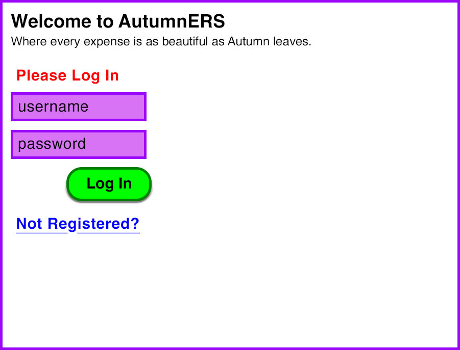
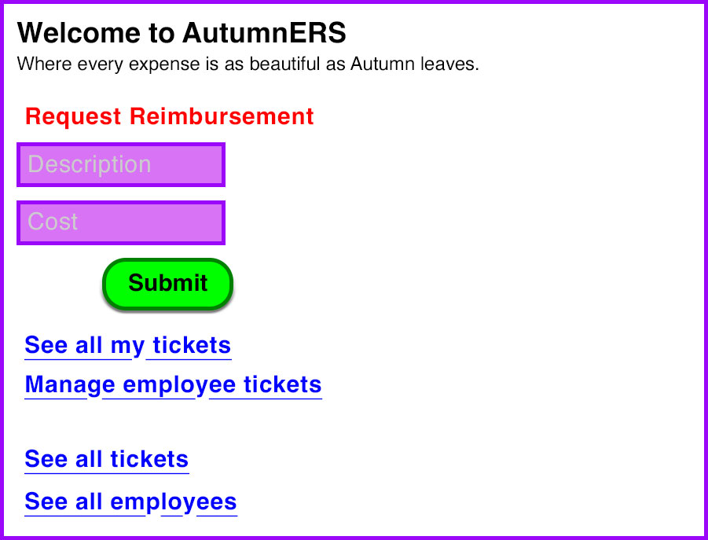
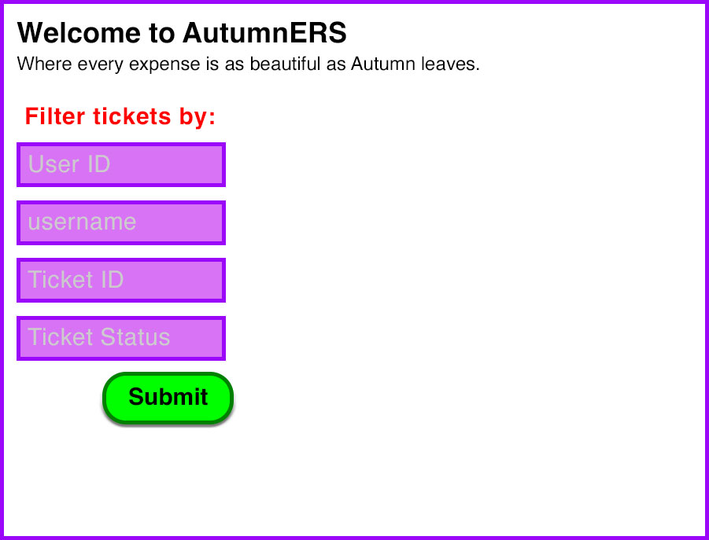

# Foundations Project: Expense Reimbursement System AutumnERS v6.0

As of August 24, 2022, I am refactoring and updating this entire project to encorporate everything we learned over the course of the 9 weeks of lectures. You can see previous versions of this project as I did them in class here and here.

## App Description

- Users submit business expenses
- Managers approve or reject submissions

### User Stories

- Users can register as Employee or Manager

- Users can login

### Employees

- can submit expense requests

- See all their own tickets (note difference between this and image at bottom when a Manager filters by employee is Managers also see the UPDATE menu)

Manaagers

- See All Users
- Find specific Users by UserID, UserName
- See All Tickets

- Filter Tickets by Status, UserName, UserID, TicketID 

(image below show users filtered by UserName or UserID)

- Can either approve or deny requests 

(image below show users filtered by Status)

### Technology

- C#
- ASP.NET
- Microsoft SQL Server
- Azure
- ADO.NET
  - [ADO.NET Overview](https://docs.microsoft.com/en-us/dotnet/framework/data/adonet/ado-net-overview)
  - [SQL Server and ADO.NET](https://docs.microsoft.com/en-us/dotnet/framework/data/adonet/sql/)
  - [ADO.NET](https://docs.microsoft.com/en-us/dotnet/framework/data/adonet/)
  - [ADO.NET code examples](https://docs.microsoft.com/en-us/dotnet/framework/data/adonet/ado-net-code-examples#sqlclient)