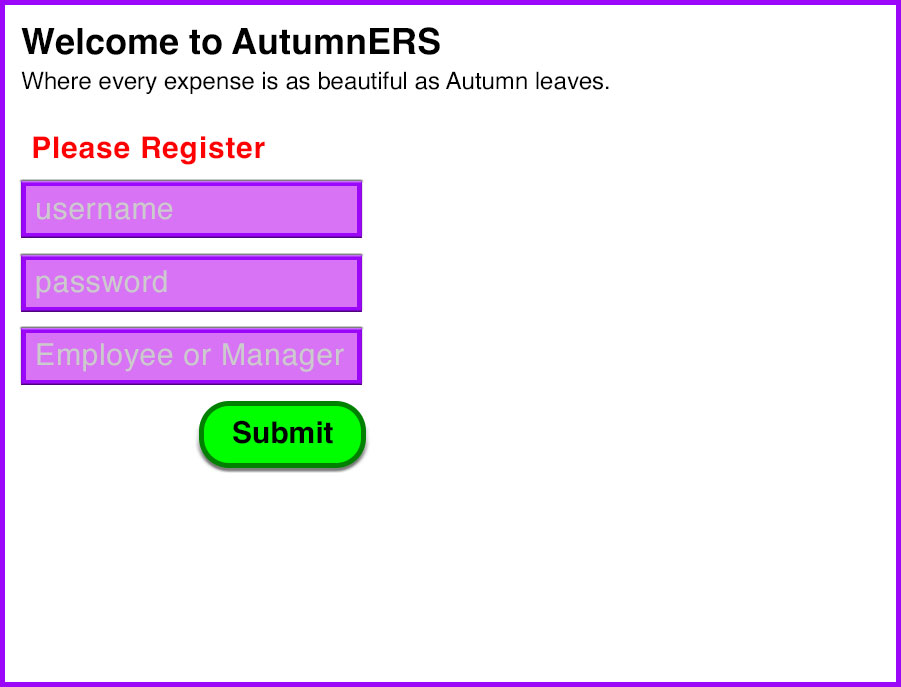
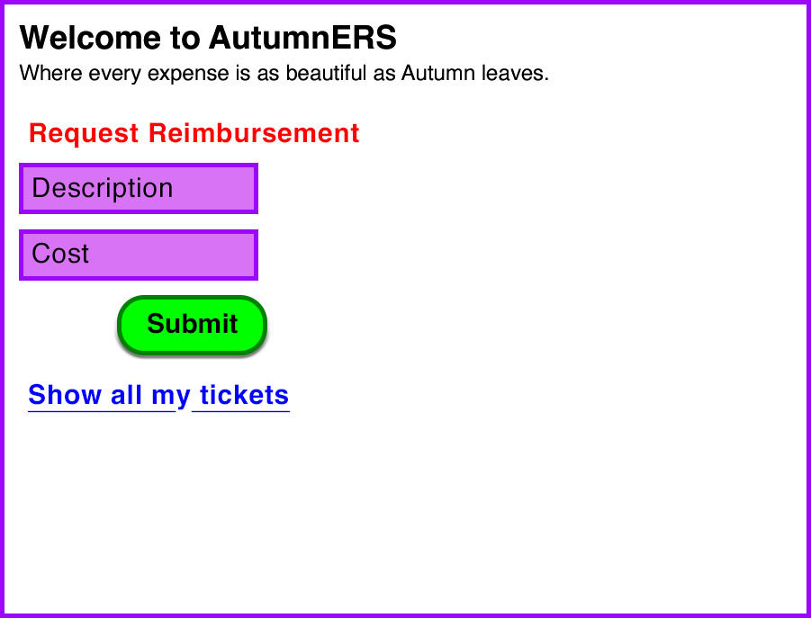
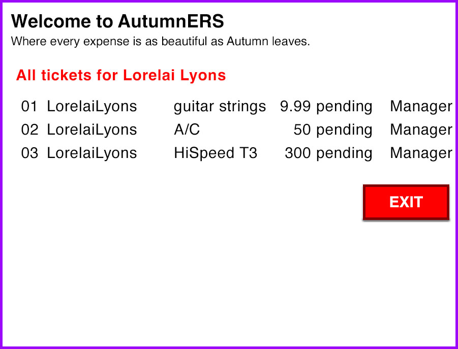
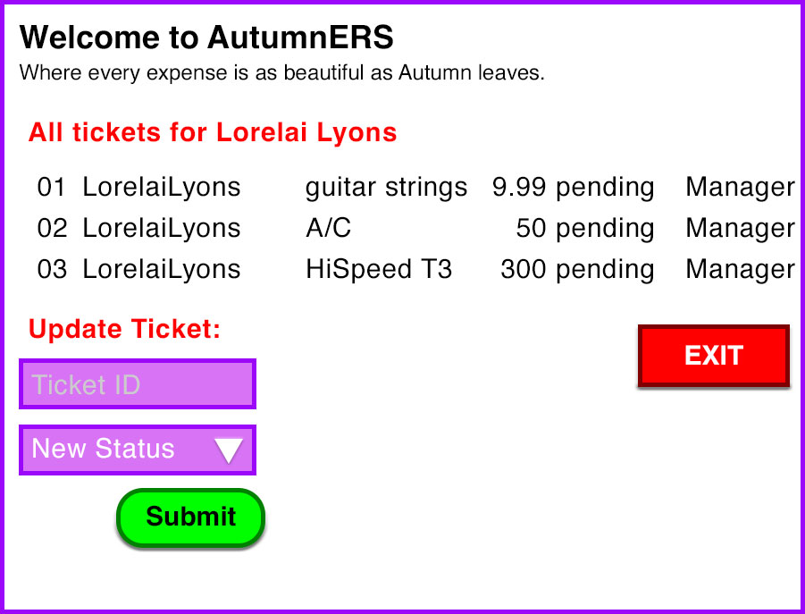
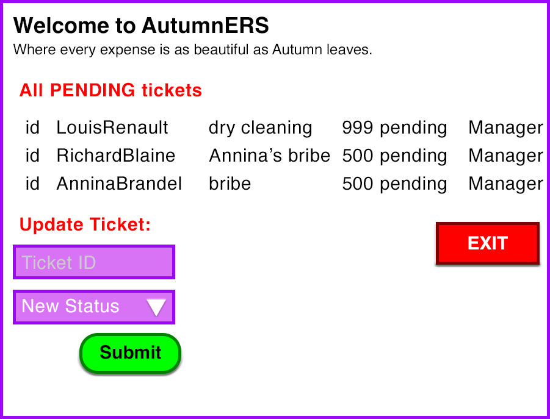

# Foundations Project: Expense Reimbursement System
# AutumnERS v5.0 - WebAPI

## Project Description 
Duration: 4 weeks
[Trello for Tracking](https://trello.com/b/qsPNwUwC/juniper-net-foundations-project)

## App Description
- Users submit business expenses
- Managers approve or reject submissions

### User Stories:
- Users can register as Employee or Manager

- Users can login

Employees 
- can submit expense requests

- See all their tickets

- Filter Tickets by Status, Date

Manaagers
- Can either approve or deny requests

- See All Users
- Filter Users by UserID, UserName

- See All Tickets

- Filter Tickets by Status, UserName, UserID, TicketID

### Technology:
- C#
- ASP.NET
- Microsoft SQL Server
- Azure 
- ADO.NET
    - [ADO.NET Overview](https://docs.microsoft.com/en-us/dotnet/framework/data/adonet/ado-net-overview)
    - [SQL Server and ADO.NET](https://docs.microsoft.com/en-us/dotnet/framework/data/adonet/sql/)
    - [ADO.NET](https://docs.microsoft.com/en-us/dotnet/framework/data/adonet/)
    - [ADO.NET code examples](https://docs.microsoft.com/en-us/dotnet/framework/data/adonet/ado-net-code-examples#sqlclient)